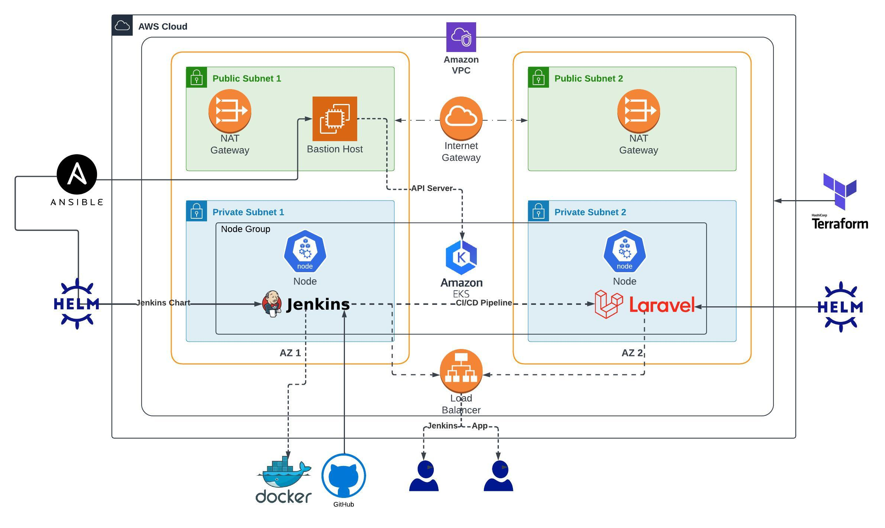

## About Project
The goal of my project was to leverage infrastructure as code with Terraform to provision a fully private EKS cluster on AWS. Additionally, I aimed to deploy Jenkins on the cluster and establish a simple pipeline for building and deploying a Laravel application to the EKS cluster.

## Tools and Technologies
- terrafrom 
-  Ansible
- Helm
- Jenkins
- AWS / EKS
- Kubernetes
- Docker
- Bash Scripting

## Diagram

